# 别只会调 API：用 Java 手搓一个能干活的 AI Agent

很多人第一次写 AI Agent，都会从一段看起来很顺的代码开始：

```java
String answer = llm.chat(userPrompt);
System.out.println(answer);
```

这当然能聊天。

但它还不是一个真正能干活的 Agent。

真正的 Agent 不只是“会回答”，而是能在一轮又一轮里完成这条链路：

```text
看见任务 -> 思考下一步 -> 调用工具 -> 观察结果 -> 更新上下文 -> 继续推进
```

这篇文章基于 [slides-project-walkthrough.html](./slides-project-walkthrough.html)，把两个 Java 教学项目串成一条清楚的工程路线：

- [AI-Agent-ZeroToOne](https://github.com/XianReallyHot-ZZH/AI-Agent-ZeroToOne)：从 0 写出一个 Agent Runtime。
- [OpenClaw-ZeroToOne](https://github.com/XianReallyHot-ZZH/OpenClaw-ZeroToOne)：从教学版 Gateway 走到企业级 Spring Boot 服务。
- [XianReallyHot-ZZH GitHub](https://github.com/XianReallyHot-ZZH)：项目主页和后续更新入口。

你不需要先背一堆框架名。

只要先抓住一句话：

> Agent 的核心不是模型本身，而是模型外面那套让它“能行动、能持续、能恢复、能接入真实世界”的工程外壳。

## 一张总图：这条 Java 路线到底在学什么

先看全局。

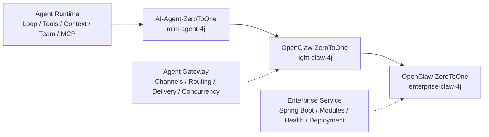

这三段不是并列知识点。

它们更像一个系统的成长过程：

1. 先让 Agent 能行动。
2. 再让 Agent 能接入多平台。
3. 最后让 Agent 能作为生产服务长期运行。

如果把 Agent 想成一个会工作的助手，那么：

- `mini-agent-4j` 教它怎么“动手做事”。
- `light-claw-4j` 教它怎么“接电话、分派任务、把结果送出去”。
- `enterprise-claw-4j` 教它怎么“进公司上班，遵守模块边界、健康检查和部署流程”。

## 第一幕：mini-agent-4j，让 Agent 先活起来

AI-Agent-ZeroToOne 的 19 个 session，最适合按顺序读。

别一上来就问“多 Agent 怎么协作”“MCP 怎么接”“权限系统怎么设计”。这些问题都重要，但它们不是第一步。

第一步只有一个问题：

> 一个 Agent 到底怎么从“会说话”变成“会做事”？

### 1. Agent Loop：让模型会转一圈

最小 Agent Loop 长这样：

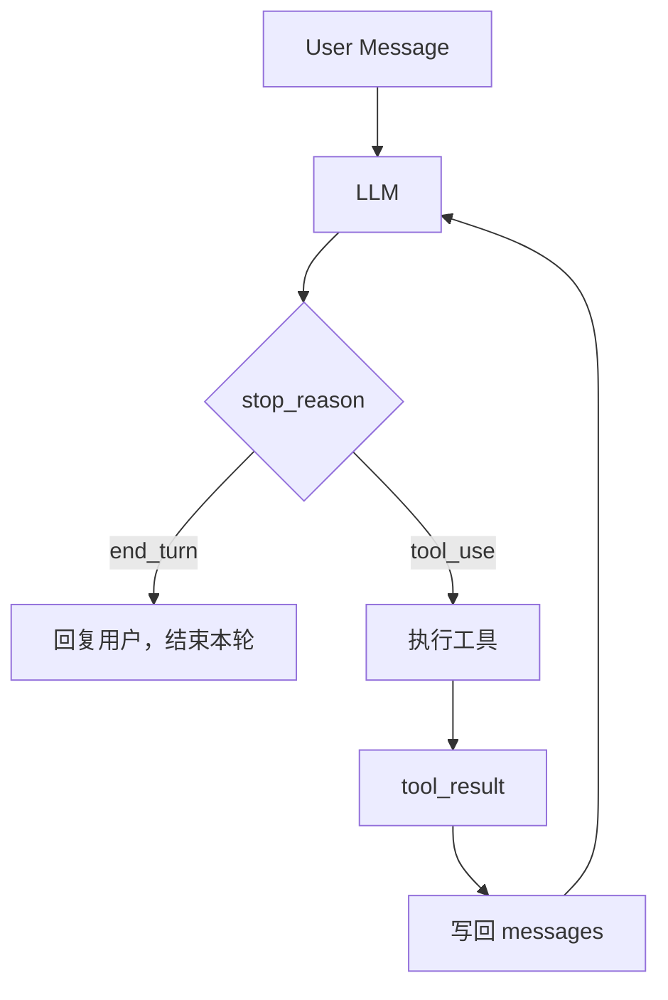

这里最关键的不是 `while(true)`。

最关键的是 `tool_result` 会写回消息列表，然后成为下一轮模型推理的观察结果。

也就是说，Agent 不是一次 API 调用，而是一段持续推进的控制过程。

### 2. Tools：给模型装上双手

模型不能自己读文件，也不能自己执行命令。

它只能说：

```text
我想调用 read_file，参数是 path=src/main/java/App.java
```

真正执行的是 Java 侧的工具分发层。

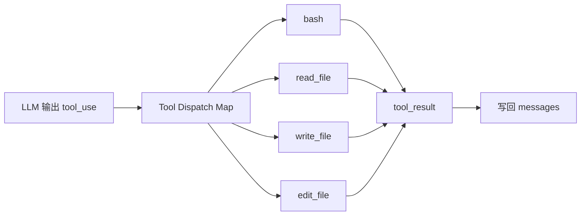

这就是 Agent 工程里非常重要的一条边界：

> 模型提出意图，系统负责执行。

一旦这条边界清楚，后面的权限、Hook、MCP 都会变得自然。

### 3. Todo、Subagent、Skill：别让模型在大任务里迷路

当任务变长，模型很容易跑偏。

所以 `S03 TodoWrite` 先把计划从“模型脑子里”拿出来，变成外部可检查状态。

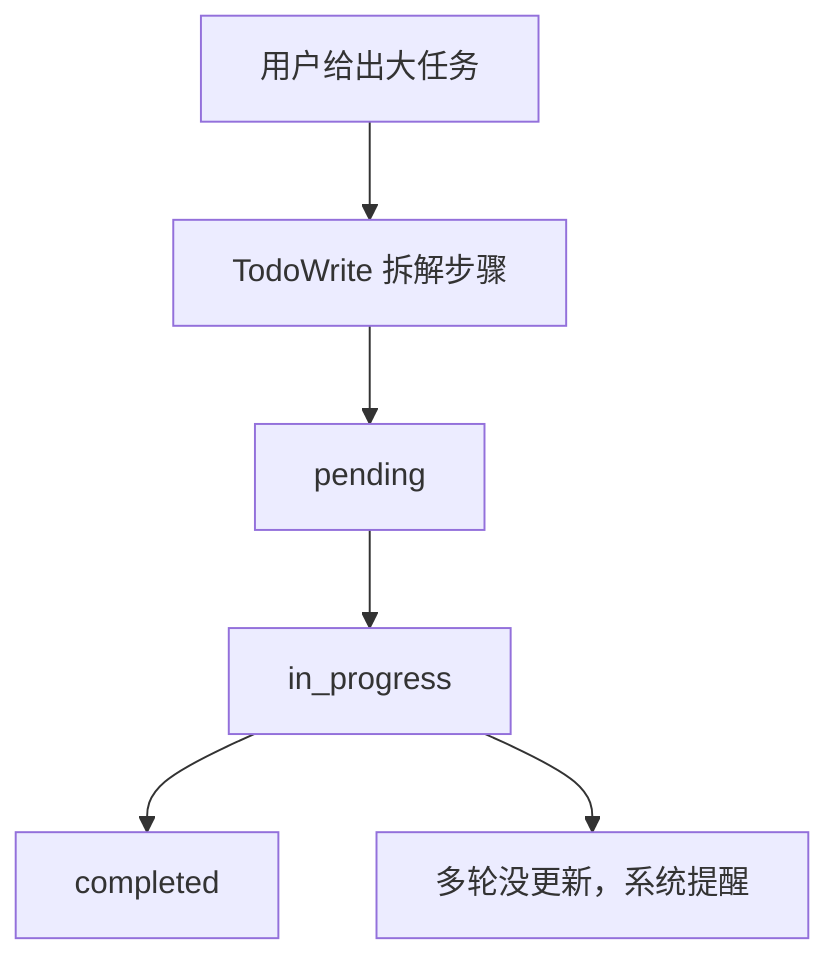

接着，`S04 Subagent` 解决上下文污染问题。

父 Agent 不需要把所有探索细节塞进主对话，它可以把局部任务外包给子 Agent：

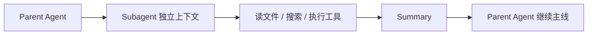

`S05 Skill Loading` 则解决知识太多的问题。

不要把所有知识一次塞进 prompt。先给目录，需要时再加载正文。

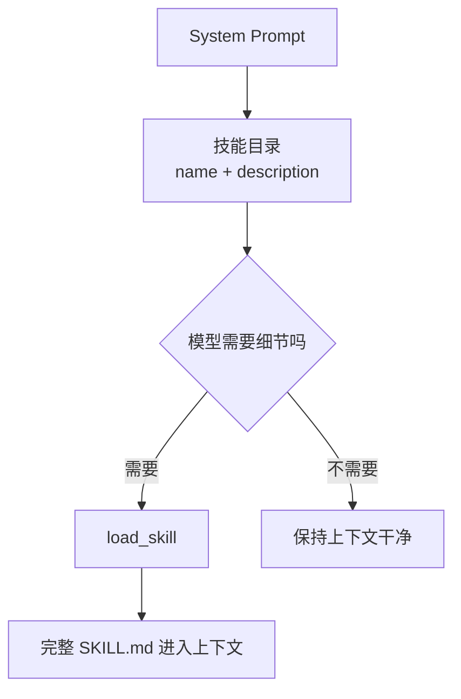

这三课合起来，讲的是一个朴素但很实用的道理：

> 长任务不要只靠模型记忆，要把计划、上下文、知识入口都放到系统边界里。

### 4. Compact、Permission、Hook：让 Agent 稳一点，也安全一点

一个能用工具的 Agent，很快会遇到三个现实问题：

- 工具输出太大，窗口爆了。
- 工具能力太强，风险变高。
- 主循环越来越胖，横切逻辑不好维护。

对应的三课是：

| Session | 它解决什么问题 | 一句话记忆 |
|---|---|---|
| S06 Context Compact | 上下文窗口不够用 | 不是丢历史，而是写交接文档 |
| S07 Permission System | 工具有副作用 | 模型可以提意图，系统决定能不能执行 |
| S08 Hook System | 扩展点变多 | 生命周期插槽，不要污染主循环 |

压缩的心智模型很简单：

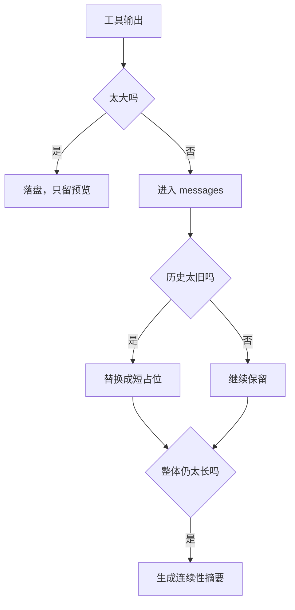

权限系统也不要想复杂。

它本质上是一条闸门：

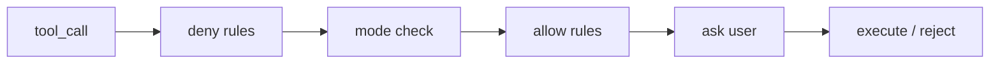

Hook 则像主循环旁边的插座。

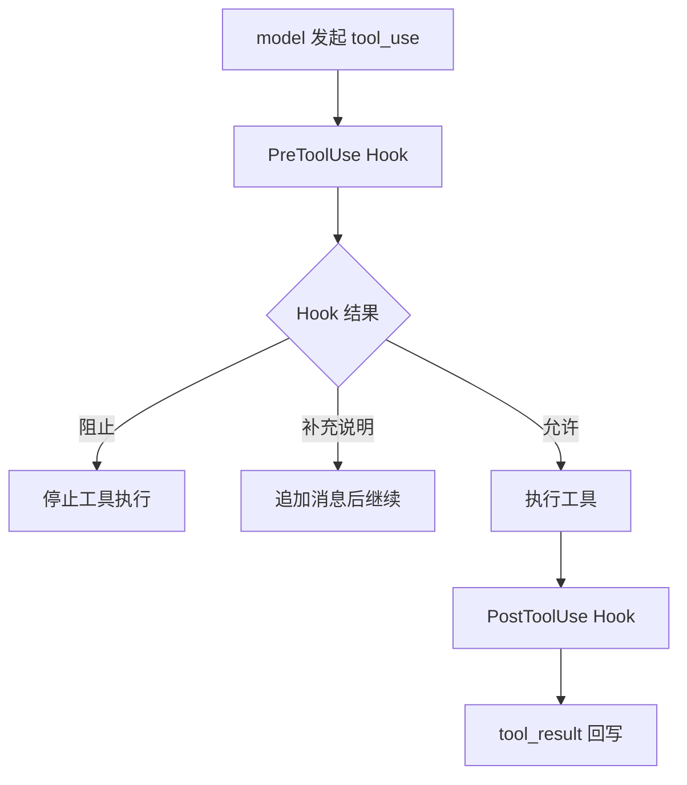

### 5. Memory、System Prompt、Recovery：让 Agent 不只是“这一轮聪明”

到这里，Agent 已经能行动，也有了安全边界。

下一步是让它更像一个稳定系统。

`S09 Memory System` 解决跨会话事实。

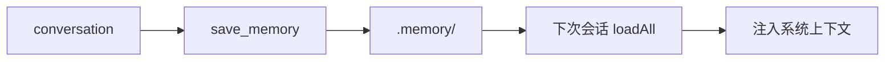

`S10 System Prompt` 解决输入装配。

System Prompt 不是一大坨字符串，而是多个来源的拼装结果：

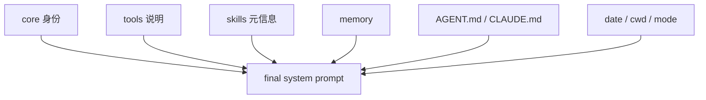

`S11 Error Recovery` 则告诉你：失败不是一种。

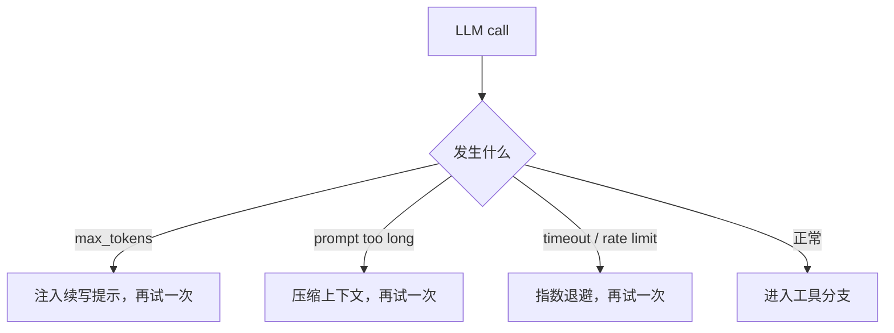

这一组课的核心，是让你把 Agent 从 demo 推到“能连续跑”的状态。

### 6. Task、Background、Cron、Team、Worktree、MCP：从一个 Agent 长成工作平台

后 8 课开始进入更大的工程边界。

可以按这张表记：

| Session | 新增能力 | 最小心智模型 |
|---|---|---|
| S12 Task System | 持久任务图 | 哪些任务被依赖，哪些任务 ready |
| S13 Background Tasks | 后台执行槽位 | 主循环继续，慢任务稍后回来报信 |
| S14 Cron Scheduler | 时间触发器 | 到点后把新意图注入同一条主循环 |
| S15 Agent Teams | 持久队友 | 不共享脑袋，共享邮箱 |
| S16 Team Protocols | 协议化协作 | request_id 把请求和响应对上 |
| S17 Autonomous Agents | 自治认领 | WORK / IDLE / poll / claim |
| S18 Worktree Isolation | 代码执行隔离 | 任务是目标，worktree 是车道 |
| S19 MCP Plugin | 外部能力接入 | MCP 仍然回到同一条工具管线 |

这一段最容易混的是 `todo`、`task`、`runtime task`。

可以这样分：

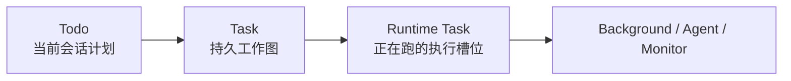

MCP 也不要学偏。

它不是另一套 Agent Loop，而是外部工具接入统一工具池：

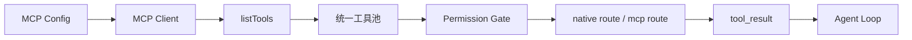

到这里，`mini-agent-4j` 的主线就很清楚了：

> 先有 Loop，再有 Tools；先能做事，再能长期做事；先单 Agent 稳定，再长出任务、团队、隔离和外部能力。

## 第二幕：light-claw-4j，把 Agent 接进真实世界

如果说 `mini-agent-4j` 重点是 Agent Runtime，那么 `light-claw-4j` 重点就是 Agent Gateway。

Runtime 回答：

> Agent 怎么行动？

Gateway 回答：

> 用户从不同平台发来的消息，怎么找到正确的 Agent，并把结果可靠送回去？

### 1. Gateway 也从 Loop 开始

OpenClaw 教学版并没有一上来就 Spring Boot。

它先用 10 个纯 Java session，把 Gateway 的每条边界讲清楚：

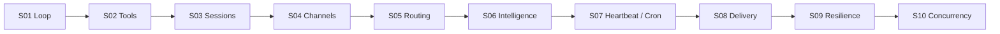

这是很适合初学者的顺序。

因为每一课都在回答前一课自然冒出来的问题。

### 2. Channels：同一个大脑，多个嘴巴

CLI、Telegram、飞书，它们的消息格式完全不同。

但 Agent Loop 不应该知道这些细节。

所以 Gateway 先把平台消息标准化：

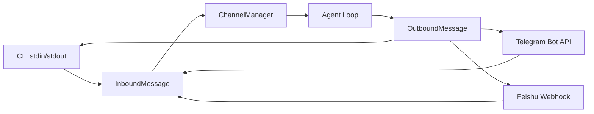

这就是 Channel 抽象的价值：

> 平台负责翻译消息，Agent 只负责理解任务。

### 3. Routing：每条消息都要找到归宿

当系统里只有一个 Agent，路由不重要。

但只要有多个 Agent，就必须回答：

> 这条消息应该交给谁？

light-claw-4j 用五级绑定表解决这个问题：

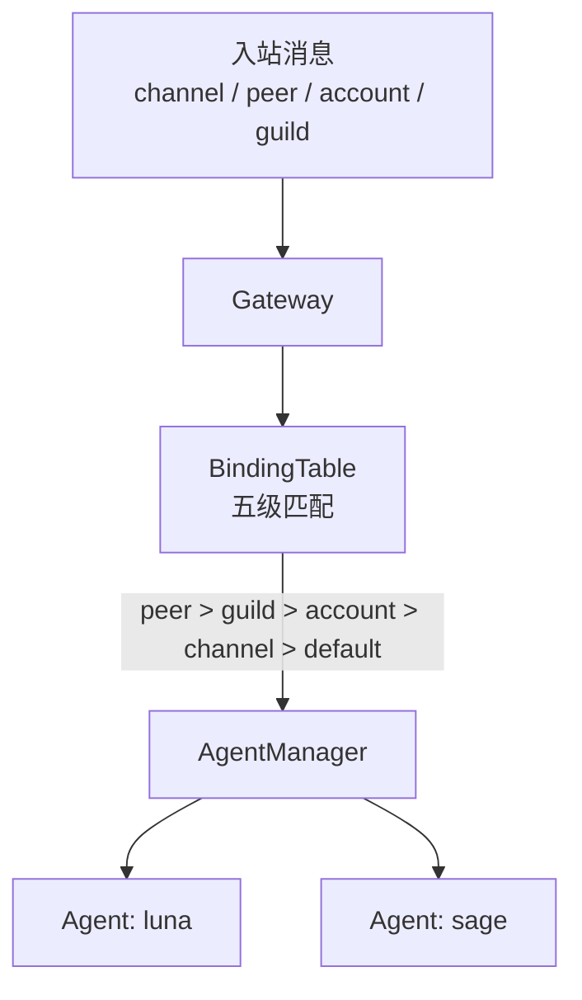

这不是复杂设计。

这是多 Agent Gateway 的最低门槛。

### 4. Sessions、Delivery、Resilience：承认世界会失败

真实平台里，最麻烦的往往不是“怎么调用模型”。

而是这些问题：

- 服务重启后，对话历史还在吗？
- 外部平台投递失败怎么办？
- 模型 key 限流怎么办？
- 上下文溢出怎么办？

light-claw-4j 的答案是：

| 能力 | 解决的问题 | 关键词 |
|---|---|---|
| Sessions | 会话可恢复 | JSONL append-only |
| ContextGuard | 上下文不过载 | 截断、压缩、重试 |
| Delivery | 外部投递可靠 | WAL、ack、backoff |
| Resilience | 调用失败可恢复 | key 轮换、异常分类、fallback |

Delivery 的心智模型尤其重要：

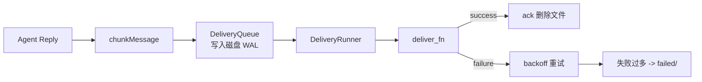

它保护的是最后一公里。

Agent 想得再好，消息发不出去，用户看到的就是系统坏了。

### 5. Concurrency：给混乱分车道

Agent Gateway 会有很多工作来源：

- 用户消息
- cron 定时任务
- heartbeat 主动检查
- delivery 后台投递

如果它们随便并发修改同一个 Agent 状态，很快会变成事故现场。

所以 light-claw-4j 引入命名 Lane：

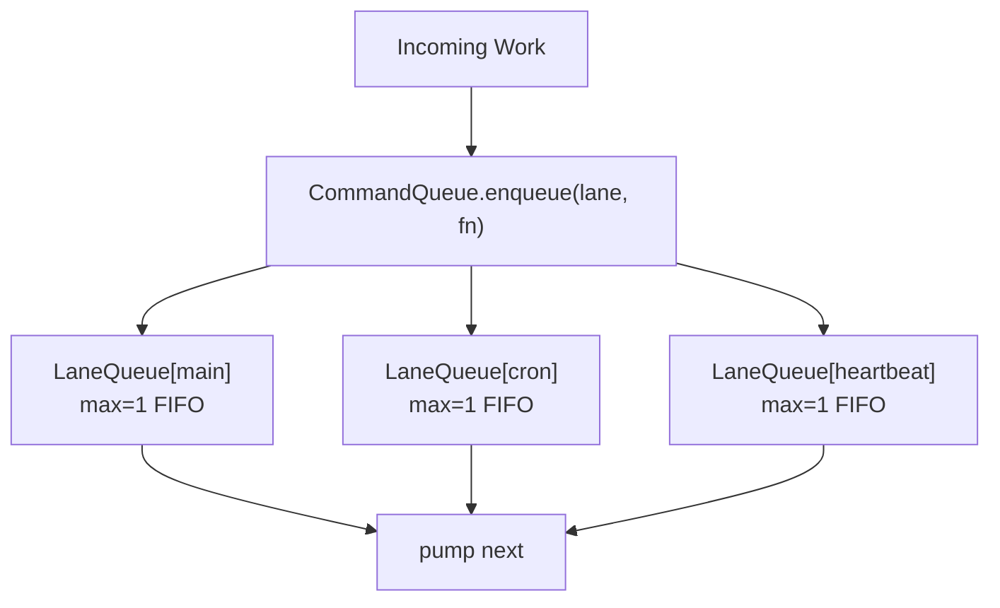

这句话很关键：

> 不要为了并发而并发。先保护状态边界，再谈吞吐。

## 第三幕：enterprise-claw-4j，生产化不是变复杂，是把边界拆清楚

到 `enterprise-claw-4j`，项目从教学脚本变成 Spring Boot 服务。

但它不是为了“显得高级”才变复杂。

它是在把 light 版里已经出现的机制，拆成更清楚的生产模块。

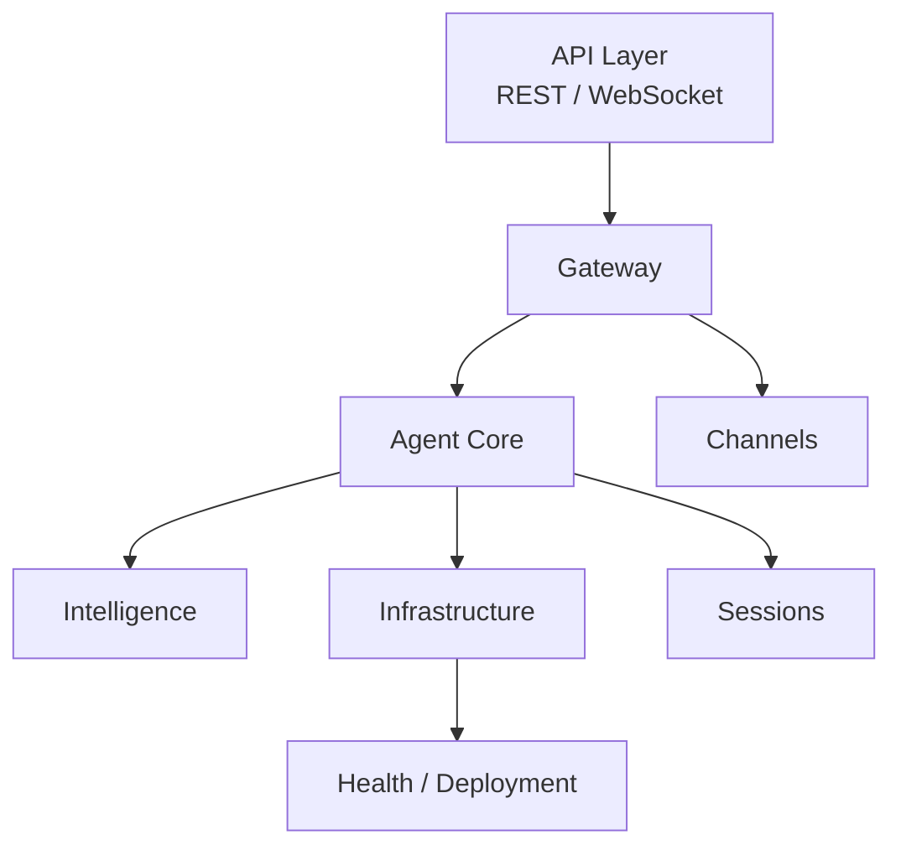

### 1. Gateway 变成服务

教学版里，Gateway 逻辑可能还在一个大文件里。

生产版会拆成：

- `GatewayService`：执行路由主流程。
- `BindingTable`：五级绑定匹配。
- `MessagePumpService`：处理入站消息泵。
- `GatewayController` / `GatewayWebSocketHandler`：暴露管理入口。

这不是换皮。

这是把“路由链路”从脚本变成可测试、可替换、可观测的服务。

### 2. Agent Core 变成可注入组件

教学版的 Agent Loop 是一段清楚的 while 循环。

生产版仍然保留这个心脏，但它周围会长出组件：

```mermaid
flowchart LR
    A["AgentLoop"] --> B["ToolRegistry"]
    B --> C["ToolHandler"]
    A --> D["ContextGuard"]
    A --> E["ResilienceRunner"]
    A --> F["SessionStore"]
```

这样做的好处是：

- 工具注册可以独立测试。
- 上下文保护可以独立演进。
- 恢复策略可以替换。
- 会话存储可以接不同后端。

### 3. Intelligence 不再是一段 prompt，而是一条装配链

企业级项目里，智能输入通常来自很多地方：

- 身份设定
- 工具说明
- 技能目录
- 长期记忆
- 项目规则
- 运行时上下文

所以 `PromptAssembler`、`MemoryStore`、`BootstrapLoader`、`SkillsManager` 会被拆成独立模块。

```mermaid
flowchart TD
    A["BootstrapLoader"] --> P["PromptAssembler"]
    B["SkillsManager"] --> P
    C["MemoryStore"] --> P
    D["Runtime Context"] --> P
    P --> M["MessageCreateParams"]
```

最重要的理解是：

> Prompt 不是文案，而是输入装配系统。

### 4. Reliability、Scheduler、Health：能跑还不够，要能长期跑

生产系统要回答的问题比 demo 多很多：

| 模块 | 它回答的问题 |
|---|---|
| Delivery | 发给外部平台的消息丢了怎么办 |
| Resilience | 模型调用失败、限流、key 异常怎么办 |
| Concurrency | 多来源工作如何不互相踩状态 |
| Scheduler | heartbeat 和 cron 如何主动触发 |
| Health | 怎么知道服务现在是否健康 |
| Deployment | 怎么启动、停止、升级、保留状态 |

这也是 enterprise-claw-4j 最值得看的地方：

它不是把教学项目“堆大”，而是把边界拆开。

## 读完整条线，你应该带走 5 个心智模型

### 1. Agent 不是模型，是模型外面的运行时

模型负责推理。

Runtime 负责让推理变成行动。

### 2. `tool_use` 是意图，`tool_result` 是观察

工具调用不是普通函数调用。

它是模型和外部世界之间的协议。

### 3. 上下文管理不是省 token，是保护连续性

Compact 的目标不是简单变短。

它要保留目标、事实、决策和未完成动作。

### 4. Gateway 的价值是隔离平台差异

CLI、Telegram、飞书都只是入口。

Agent 应该看到统一的消息协议。

### 5. 企业化不是堆框架，是把边界变成模块

能跑只是开始。

能恢复、能观测、能部署、能优雅关闭，才接近真实系统。

## 如果你准备读源码，建议这样走

### 20 分钟快速版

1. 看 `mini-agent-4j` 的 `S01AgentLoop.java` 和 `S02ToolUse.java`。
2. 看 `light-claw-4j` 的 `S04Channels.java` 和 `S05GatewayRouting.java`。
3. 看 `enterprise-claw-4j` 的 `GatewayService` 和 `AgentLoop`。

### 2 小时系统版

1. AI-Agent：S01 到 S11，先完整理解单 Agent Runtime。
2. OpenClaw light：S01 到 S10，理解 Gateway 的工程边界。
3. Enterprise：overview、gateway、agent-core、intelligence、delivery、resilience、concurrency。

### 完整学习版

按 slides 的顺序走：

```text
AI-Agent-ZeroToOne 19 sessions
  ->
OpenClaw light-claw-4j 10 sessions
  ->
OpenClaw enterprise-claw-4j 8 modules
```

不要一开始横向比较两个项目。

先让每个项目自己的逻辑长出来，再回头比较同一个机制在不同阶段的形态。

## 常见误区

### 误区 1：把所有能力都塞进 prompt

Prompt 不是垃圾桶。

稳定规则、动态事实、工具说明、记忆、技能目录，应该有不同入口。

### 误区 2：让模型直接决定副作用

模型可以提出“我想执行什么”。

但是否执行，必须经过系统边界。

### 误区 3：把 todo、task、runtime task 混成一个词

它们生命周期不同。

混在一起，后面多 Agent 和后台任务会很难讲清楚。

### 误区 4：认为 MCP 是另一套 Agent 系统

在这条教学主线里，MCP 最好先理解成外部工具来源。

它最终仍然接回 tool router、permission 和 tool_result。

### 误区 5：一上来就追求并发

Agent 系统最先要保护的是状态一致性。

并发是后面的事。

## 结尾：真正值得学的是“控制面”

今天很多 Agent 文章都在讲模型。

模型当然重要。

但如果你想把 Agent 做成一个真实系统，更值得反复琢磨的是模型外面的控制面：

- 谁来保存上下文？
- 谁来执行工具？
- 谁来决定权限？
- 谁来压缩历史？
- 谁来恢复失败？
- 谁来路由消息？
- 谁来保证投递？
- 谁来管理并发？
- 谁来部署和观测？

当这些问题都有清楚的答案，Agent 才从“会聊天的 API 包装器”，变成“能干活的工程系统”。

这也是这条 Java 路线最有价值的地方：

> 它不是带你背概念，而是带你一层一层手搓出 Agent 系统真正需要的骨架。

## 相关资料

- HTML Slides：[slides-project-walkthrough.html](./slides-project-walkthrough.html)
- PDF Slides：[slides-project-walkthrough.pdf](./slides-project-walkthrough.pdf)
- PPTX Slides：[slides-project-walkthrough.pptx](./slides-project-walkthrough.pptx)
- AI-Agent-ZeroToOne：[https://github.com/XianReallyHot-ZZH/AI-Agent-ZeroToOne](https://github.com/XianReallyHot-ZZH/AI-Agent-ZeroToOne)
- OpenClaw-ZeroToOne：[https://github.com/XianReallyHot-ZZH/OpenClaw-ZeroToOne](https://github.com/XianReallyHot-ZZH/OpenClaw-ZeroToOne)
- GitHub 个人主页：[https://github.com/XianReallyHot-ZZH](https://github.com/XianReallyHot-ZZH)
