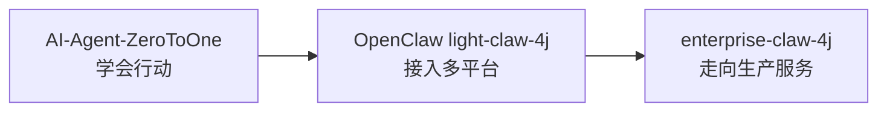
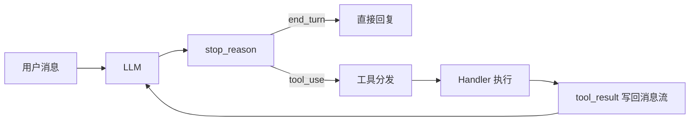
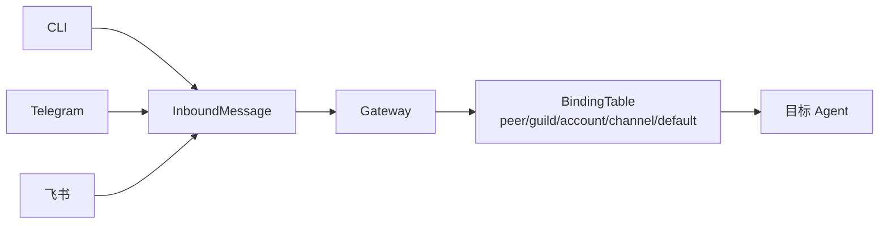
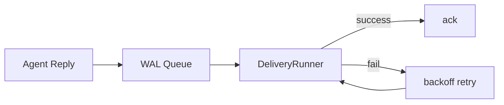
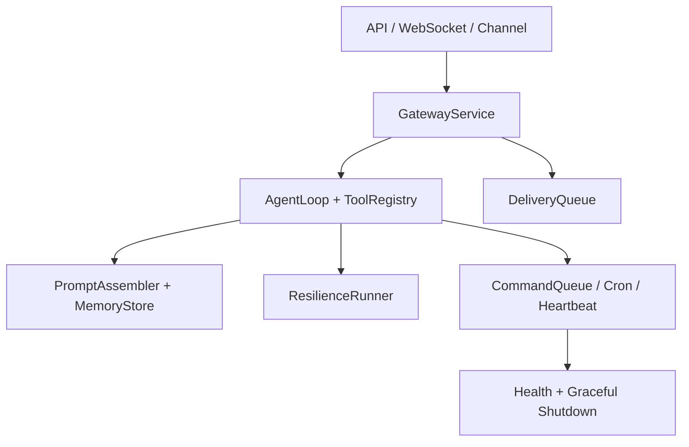
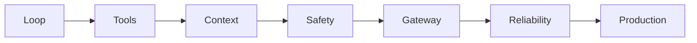

# 别只会调 API：用 Java 把 AI Agent 从玩具 Demo 带到生产系统

很多 AI Agent Demo 看起来很聪明：输入一句话，模型回一段答案，再加几个工具调用，好像就拥有了“自动干活”的能力。

但真正写到工程里，很快会遇到一串朴素却棘手的问题：它怎么记住自己做到了哪一步？工具越权怎么办？上下文爆了怎么办？接入 Telegram、飞书、CLI 之后，消息该路由给谁？外部平台发送失败，回复会不会丢？

这份项目拆解给出的答案很直接：先写一个能行动的 Agent Runtime，再把它接进多平台 Gateway，最后拆成可以部署、可以观测、可以恢复的 Spring Boot 服务。



## 第一幕：Agent 不是魔法，是一个闭环

AI-Agent-ZeroToOne 的起点很小：一个 `agentLoop`。它不急着谈“自主智能”，而是先把最小闭环跑通。



这个闭环有一个很重要的工程判断：**智能在模型里，但秩序在 Harness 里**。模型可以提出 `tool_use`，系统必须负责工具注册、权限检查、结果回写和下一轮上下文。

所以工具不是“随便暴露一个函数”：

```java
Map<String, Function<Map<String, Object>, String>> toolHandlers
```

Schema 面向模型，Handler 面向真实世界，中间用工具名连接。这个小小的 Map 往后会长出权限系统、Hook、MCP 插件，甚至多 Agent 的协作边界。

更有意思的是，项目没有把 Agent 讲成一个“永远聪明的大脑”。相反，它一直在给大脑加外部支架：

- `TodoWrite` 把长任务计划外置，避免模型靠隐式记忆硬撑。
- `Subagent` 用独立上下文处理局部探索，主对话只接收摘要。
- `Skill Loading` 先给目录，需要时再加载正文，减少上下文噪声。
- `Context Compact` 把压缩当成交接文档，而不是粗暴删历史。
- `Permission` 和 `Hook` 把副作用关进统一管线，审计、拦截、改写都有位置。
- `Memory` 只存跨会话仍然重要的事实，不把聊天记录当知识库。

到后半段，Agent 开始变得像一个小型工作系统：任务图、后台任务、Cron、团队邮箱、握手协议、自治认领、Worktree 隔离、MCP 外部工具接入。核心思想仍然没变：**所有能力都回到同一条消息和工具管线里**。

## 第二幕：会干活以后，要学会进门和找人

OpenClaw light-claw-4j 解决的是另一个问题：同一个 Agent，怎样进入多平台世界？

CLI、Telegram、飞书的消息格式都不一样，但 Agent 不应该理解这些平台细节。Gateway 要做的第一件事，就是把外部混乱翻译成统一入口。



这里的关键不是“支持几个平台”，而是把边界拆清楚：

- `Channel` 负责平台适配。
- `SessionStore` 用 JSONL append-only 记录会话，重启后可以重放。
- `BindingTable` 用五级规则把消息路由到正确 Agent。
- `Prompt / Skills / Memory` 组成智能输入装配链。
- `Heartbeat / Cron` 让 Agent 不只被动回答，也能主动触发。

当 Agent 真正接进外部平台后，可靠性会立刻变成主角。消息发出去之前先写 WAL，失败后后台退避重试；模型调用失败时，认证、限流、上下文溢出、工具错误要分层处理；`main`、`cron`、`heartbeat` 这些工作不能随意并发修改同一个状态，于是需要命名 Lane 串行化。



这也是 light-claw-4j 最值得看的地方：它不是先上复杂框架，而是用纯 Java 把 Gateway 的工程语义讲清楚。

## 第三幕：生产化不是堆复杂度，是把边界做成模块

enterprise-claw-4j 把前面的教学代码拆成 Spring Boot 服务。它做的不是“换个框架重写一遍”，而是把章节级边界升级成模块级边界。



生产系统最怕的不是“功能少”，而是“出了问题不知道卡在哪里”。所以 enterprise 版本把每个问题都放到明确位置：

- Gateway 负责路由、绑定和消息泵。
- Agent Core 负责模型循环、工具注册、上下文保护。
- Intelligence 负责 Prompt、技能和记忆的分层装配。
- Delivery 和 Resilience 分别保护外部投递与模型调用。
- Concurrency 和 Scheduler 管住主动触发与状态修改顺序。
- Health、Graceful Shutdown、Docker/K8s 文档把运行边界补齐。

这条路线最有价值的地方，是它没有把 AI Agent 神秘化。一个能工作的 Agent，本质上是模型能力和工程纪律的结合：模型负责推理，系统负责协议、状态、权限、恢复和部署。

## 一句话总结

如果你只看 Prompt，Agent 像魔法；如果你看完这三条项目线，Agent 更像一套不断长大的工程系统：



先让它会行动，再让它能接入真实世界，最后让它在失败、并发、部署和运维压力下仍然可恢复。到这里，AI Agent 才不只是一个漂亮 Demo，而是开始接近“能干活的系统”。

## 参考项目

- [AI-Agent-ZeroToOne](https://github.com/XianReallyHot-ZZH/AI-Agent-ZeroToOne)：从 5 行 Agent Loop 开始，逐步实现工具、上下文、权限、记忆、多 Agent 与 MCP。
- [OpenClaw-ZeroToOne](https://github.com/XianReallyHot-ZZH/OpenClaw-ZeroToOne)：包含 `light-claw-4j` 教学版 Gateway 和 `enterprise-claw-4j` 生产化拆分。
- [XianReallyHot-ZZH GitHub 主页](https://github.com/XianReallyHot-ZZH)：更多 AI Agent 与 Java 工程化项目。
